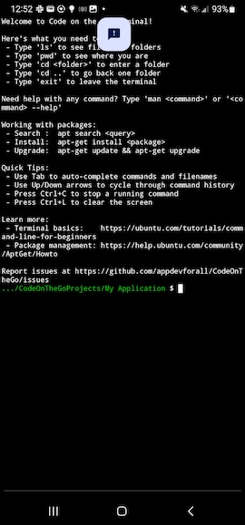

# First console program

In this lesson you are going to create a Java _console application_. This type of application cannot be run from an icon on your phone, and it does not have a graphical display. Instead, it can only be run from within a terminal window. This kind of application is not very exciting, but is much simpler than a full graphical application. We will use console applications to investigate aspects of Java before we are ready to incorporate those concepts into full applications.

## Creating a console application

**NOTE:** The instructions here are quite convoluted because it's not possible to create a console application directly from Code on the Go. Nor is it possible to run a console application from Code on the Go. The IDE _will_ correctly build a console application when you click the build-and-install icon. However, an error message is then shown at the end. Replace much of the start up here with something simpler if the IDE supports it.

1. In the Code on the Go main menu, select "Open a saved project" and then select the application you created earlier, "My Application." The project should open and build.

2. Click the project menu button  to bring up the project file tree and left-side button.

3. Click this button to bring up a terminal window into your project:


This time the terminal window prompt looks a little different:

---


---

The prompt shows that you are inside the directory of your project, `My Application`:

```sh
.../CodeOnTheGoProjects/My Application $
```

We are going to use this graphical project to create a new, console project.

## Create the console project

1. Create a new, sibling directory using the `mkdir` command.

     .../CodeOnTheGoProjects/My Application $ mkdir ../Hello
 
3. Create a new project in that directory using the `gradle` tool.

     .../CodeOnTheGoProjects/My Application $ bash gradlew init --project-dir ../Hello --type java-application --use-defaults

This will start the `gradle` program to initialize your new project. When finished, you should see `BUILD SUCCESSFUL` on the next-to-last line.

```sh
.../CodeOnTheGoProjects/My Application $ mkdir ../Hello
.../CodeOnTheGoProjects/My Application $ bash gradlew init --project-dir ../Hello --type java-application --use-defaults

> Task :init
Learn more about Gradle by exploring our Samples at https://docs.gradle.org/8.14.3/samples/sample_building_java_applications.html

BUILD SUCCESSFUL in 1s
1 actionable task: 1 executed
.../CodeOnTheGoProjects/My Application $
```

Type `exit` to exit the terminal back to the Code on the Go application.

Then, use the close project button
(
in the project menu to close the project and return to the _Recent projects_ list.

## Opening your console project

1. From the _Recent projects_ list, click _Open from folder_.
2. Select _Hello_, the new project you just created. You will see a list of files in the folder.
3. Click _USE THIS FOLDER_ to confirm that you want to open the project. You may also have to allow Code on the Go to access files in the folder in a popup dialog.

The project will initialize and open. This may take several seconds.

## Building and running your console project

**NOTE:** This section would be a lot simpler if there were a way to
build and run console applications from within Code on the Go.

From the project menu, click the terminal button
()
to bring up the terminal again, but this time in your new project.

```sh
.../CodeOnTheGoProjects/Hello $
```

Now use the `gradlew` tool to build the application.

```sh
.../CodeOnTheGoProjects/Hello $ bash gradlew build
Calculating task graph as no cached configuration is available for tasks:
> Task :app:processTestResources NO-SOURCE
> Task :app:processResources NO-SOURCE
> Task :app:compileJava
> Task :app:classes
> Task :app:jar
> Task :app:startScripts
> Task :app:distTar
> Task :app:distZip
> Task :app:assemble
> Task :app:compileTestJava
> Task :app:testClasses
> Task :app:test
> Task :app:check
> Task :app:build

BUILD SUCCESSFUL in 8s
7 actionable task: 7 executed
Configuration cache entry stored.
.../CodeOnTheGoProjects/Hello $
```

The `BUILD SUCCESSFUL` message means your application is build and ready to run.

## Running your console project

Use the `java` program to run the compiled application.

```sh
.../CodeOnTheGoProjects/Hello $ java --class-path app/build/classes/java/main org.example.App
Hello World!
.../CodeOnTheGoProjects/Hello $
```

The next-to-last line, `Hello World!` is the output of your new
console application.

That command was rather complex. Let us look at each part in more
detail:

- `java` - This is a request to run the built-in Java system. The Java
    system will load your built application and run the code.
- `--class-path` _path_ - This tells Java where to find the built code
    for your application. The path here is determined by the way the
    project was set up.
- `org.example.App` - This is the name of the main code for your
    application, a Java _class_. We will look at the code in detail
    later in this lesson.

## Exploring the application

Type `exit` to exit the shell and return to Code on the Go. Then click
the menu button to open the file tree, if it is not already open.

Open directories under `app/src/main/java` until you can see the
`App.java` file. Click on that file to open it in the editor. It
should look something like this:

```Java
/*
 * This source file was generated by the Gradle 'init' task
 */
package org.example;

public class App {
    public String getGreeting() {
        return "Hello World!";
	}

    public static void main(String[] args) {
        System.out.println(new App().getGreeting());
    }
}
```

Some things in this file should look familiar:

- `"Hello World!"` - A Java `String` literal. This is the string value that
    the project displayed when run from the terminal.
- `System.out.println` - The `println` method of the system out
    variable, which we explored in the previous lesson.

However, there are a lot of new things, too. Lets look at them
carefully.

### Comments

```Java
/*
 * This source file was generated by the Gradle 'init' task
 */
```

This is a _comment_. It contains text for humans not for the
computer. Comments are documentation to help you and others understand
what the program does. There are three ways to write comments in Java.

1. Text between `/*` and `*/`, which can take up one or more lines.

2. Text between `/**` and `*/`, which can take up one or more
    lines. These comments are special, because they comprise
    `Javadoc`-style documentation about your program. We will explore
    these comments in a later lesson.

3. Text between `//` and the end of the line. These are one-line
    comments. They are useful to guide the user through sections of
    your code.

Some examples.

```Java
/* This is a one-line comment. */

# This is also a one-line comment.

/*
 * This is a multi-line comment. Usually you
 * start subsequent lines with " * *" so that
 * the asterisks line up.
 */

/**
 * This is a Javadoc comment. It is used in special
 * places in your code in order to generate fancy
 * documentation of your application.
 */
```

### Package definition

```Java
package org.example;
```

This designates which _Java package_ the code in the source file will
go inside. This also fixes the directory structure of the file within
the project. (That's why App.java is inside
`app/src/main/java/org/example` - the application code source files
are in `app/src/main/java`, and packages create directories below
that.

Packages in Java allow you to divide up your program into more
manageable units. They also allow you to name your code in such a way
as it will not conflict with code from someone else. If you are doing work for a
company or organization, you can use their Internet domain name in
reverse. For example, if you work for a company with domain `abc.com`
you could use a package name of `com.abc`.

You can be fairly confident that you won't conflict with outside
libraries if you continue to use `org.example`, but you probably won't
be able to share your code with others. If you have no other obvious
alternative, you can use the `me` top-level domain. For example, if
your name is Pat Sharp you could use `me.patsharp` and be fairly
confident you won't conflict in naming with anyone else.

### Class definition

```Java
public class App {
    ...
}
```

This outer shell for the rest of the code in `App.java` defines a new
type, a _Java class_ called `App`. Classes must be in files with the
same name: `App` needs to be defined in `App.java`.

We have already seen one Java class, `String`. A class is a Java type
which represents an _object_ rather than than a _primitive_ value. An
object can have both data and _behavior_, in the form of methods.

Primitive types, in contrast, hold data but do not have any associated
methods. We will explore some primitive types in the next lesson.

### Method definitions

```Java
public String getGreeting() {
    return "Hello World!";
}
public static void main(String[] args) {
    System.out.println(new App().getGreeting());
}
```

These lines inside the definition of the `App` class define two
methods. The first, `getGreeting`, takes no arguments and returns a
`String` result, the "Hello World!" message that the application will
print. Let's consider parts of that method separately.

- `public` - This says that the method should be generally available
    as an operation in the `App` class. There are three more
    restrictive ways to define a method which we will consider later.
- `String` - The type name before the method name `getGreeting` is the
    _return type_ for the method. If you call the method, you will get
    a value back of that type. This means that `getGreeting` will
    always return a single `String` result.
- `getGreeting` - The name of the method. This is the name that other
    code will use to call the method on objects of type `App`.
- `()` - The empty parentheses indicate that the method takes no
    arguments.
- `return` - This starts a _return statement_, which indicates what
    the method should return to the caller. In this case the string
    `"Hello World!"` is always the return value.
- `{` and `}` - The body of the class is enclosed by curly braces.

Note that the `return` statement ends with a semicolon (`;`). Java
statements usually end with a semicolon. It is an error if the
semicolon is missing.

The definition of the other method is a little different.

- `public static` - This also indicates that the method is generally
    available to other code. The word `static`, however, indicates
    that this is a _class method_ rather than an _object method_. We
    will cover that distinction later. For now, every Java console
    application, one that you run in a terminal, has to have a class
    method called `main`, as here.
- `void` - This is a special type name that indicates no return
    value. You can see that there is no `return` statement in this
    method. That would be illegal in a `void` method.
- `main(String[] args)` - This says that the `main` method takes
    arguments, in this case an _array_ of `String` values. We will
    investigate arrays later.
- `new App()` - This is a special operation that creates a new instance
    of type `App`.
- `new App().getGreeting()` - After creating the new instance, this
    calls the `getGreeting` method to get the string value to pass to
    `println`. In other words, we create a new object of type `App`,
    call `getGreeting` to get `"Hello World!"`, and then pass that to
    `println` to print the message on the console.

## Exercises

1. Change the greeting shown by the `App` program to be
    `"Hello Everyone!"`. Build the program and run the new version to make sure
    it still works.

2. Programs will not build if they do not conform to Java syntax. Try
     out these changes and see what happens when you build the
     modified program. Undo the change after each test.
	 - Remove the semicolon after the `return` statement.
	 - Remove the closing brace (`}`) in the `getGreeting` method.
	 - Change the name of the first method definition from
        `getGreeting` to `getMessage`, but do not change the call in
        the `main` method.
