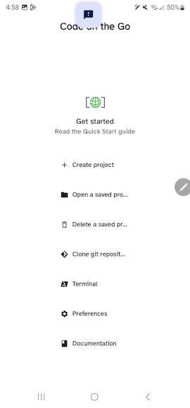
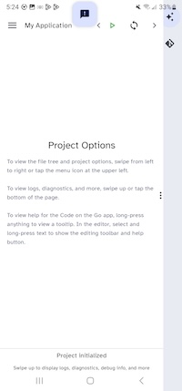
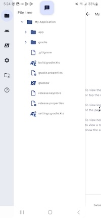
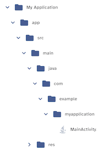
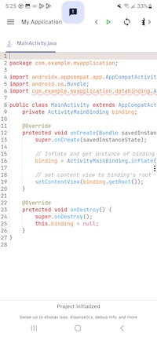

# Introducing Code on the Go

This lesson will introduce you to the Code on the Go environment, and have you create and install a new application on your phone. The application does not do much, but we will add to it over time.

## Introducing the AppDev4All environment

If you have not already started Code on the Go, click the application icon to start it:

You should see the main screen:

---

---

Code for an application is organized into a _projects_. From the main screen you can create a new project, open an existing project, set preferences, read documentation such as this book, and several other options.

If this is the first time you have run the application, you should also read the Quick Start guide using the link in the main menu.

## Your first application

Select _Create project_ to start creating a new project. A screen will appear with project templates to choose from. Click the _Empty Activity_ to choose that template. This will create a project for an application that will have a single page with a message saying "hello."

A new screen will appear asking you to choose a name for the application, with a default value of "My Application." For now, you can leave this alone. Click _Create project_ to finish creating the project. This may take a while, depending on the speed of your phone.

You should then see the main page for your new project:

---

---

## Browsing the project files

Your project is composed of several files and directories, in a somewhat complicated arrangement. We will discuss the details of the structure later. For now, you just need to know how to see the structure, see what files are present, and open files in the editor.

To start browsing the files in your project, you can either swipe from left to right or click the menu icon in the upper left: 

You should then see the tree of files in your project:

---

---
You can click on directories to open and close them in order to see what they contain. Open the _app_ directory, then open the _src_ directory underneath it. Finally, open the _java_ directory at `app/src/main/java`. It will open several directories underneath, ending in the single source file for the application, _MainActivity.java_. You can scroll the file list left and right, if you cannot see the whole name of some files.

---

---

 Selecting a file in the tree will open the file in a text editor. Click on _MainActivity.java_ to open it in the editor. It should look like this:

---

---

We will explore the application code in detail later. For now, you just need to know how to close the editor window when you want to. To close the window with _MainActivity.java_, tap on the file name at the top of the editor tab, and select _Close this_.

## Building and installing the application

At this point you will build and install the application from the project. Near the top right, click the green right-arrow icon: 

This will build your application and attempt to install it onto your phone. At the end of the build process, a dialog will appear asking whether to install the application. Tap _Install_ to install the built project as the application _My Application_.

Another dialog may appear recommending an "App scan." In this case the app cannot do anything harmful, and you may not have an internet connection to Google, so we should skip this step.

Click _More details_, then click _Install without scanning_. You may be asked for your PIN or other authentication mechanism to install the application.

Android will tell you if the installation is successful or not. If it installs successfully, Android will tell you so, and will allow you to launch the application. Tap _Yes_ to launch your new application. It has a single screen that just says "hello" and should look something like this:

---

---

## Closing the project

You can close the project and return to the _Recent projects_ list by tapping the menu icon  and clicking the "close project" button: 

You can return to the main menu by clicking _Exit_ from the _Recent projects_ menu.
To reopen the project, go to the _Recent projects_ list from the main menu by clicking _Open a saved project_, if you are not already on _Recent projects_. Then select the project name.

## Next steps

Congratulations! You have created your first Android application. Of course, it does not do anything yet. We have to learn some Java fundamentals before we can add functionality to create an application that is useful.

## Exercises

1. See if you can change the message that shows up in the application. Open the file `activity_main.xml` in the directory `src/res/layout` and find where the message "Hello user!" is defined. Change it to "Goodbye user!" and build and reinstall the application. Make sure the message is changed when the application runs.

2. A line in `MainActivity.java` starts with `super.onCreate`. Edit the line to say `supr.onCreate` instead. The word `supr` should now show with a squiggly line underneath it. This indicates that there is an error here. Press the green build-and-install button . What happens? Fix the word to be `super` again and press the build button again. What happens now?
