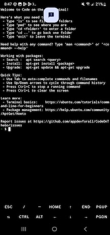

# Java concepts

## Starting the jshell

If a project is open, close it. Then click _Exit_ to go to the main menu.

From the main menu, click the _Terminal_ button. This should change the screen to look like this:



## The Android terminal window

**NOTE**: Ideally something like `jshell` (which can be accessed programmatically using the JDK, BTW) would be built-in to Code on the Go, so the instructions on how to start and stop the `jshell` would be different, and would not involve an actual Linux shell.

The terminal window is called a _shell_ window. It allows you to perform command-line operations in the underlying Linux operating system. One such command is `ls`, which stands for "list files." (Linux has many commands with very short abbreviations like this.) Try that command out by typing `ls` followed by Enter like this:

```
- $ ls
android-sdk  maven
- $
```

Your result should look something like this, but may not match exactly. In this case there are two items in the current directory, `android-sdk` and `maven`.

We will cover other useful shell commands later. But for now we want to run a special command that starts a _Java shell_ called `jshell` where we can try out Java features. Start `jshell` by typing `jshell` followed by Enter.

```
- $ jshell
|  Welcome to JShell -- Version 21.0.7
|  For an introduction type: /help intro

jshell>
```

## Variables and objects

Start your session with `jshell` by typing `var message = "hello"`, followed by Enter. (All commands in the `jshell` end with Enter, so we will assume you will remember to use Enter at the end from now on.)

```
jshell> var message = "hello"
message ==> "hello"

jshell> 
```

There are several parts to what you typed and how `jshell` responded.

- `var` - This is a Java _reserved word_, a special world to the Java compiler. You can only use reserved words in the way the designers of Java have intended. You cannot name any parts of your program using reserved words.

- `message` - This is a Java _identifier_, a name for something in a program. In this case it names a new _variable_. All data in running Java programs are stored in variables.

- `=` - This is a Java _operator_, in this case the _assignment operator_. Here it serves to assign what is on the right of `=` to the new variable `message`.

- `"hello"` - This is a java _literal_ value. Literal values are numbers, strings, or other values that can be assigned to variables.

Put together, this is a Java _statement_, or a unit of work in the program. This statement serves to define a new variable, `message`, and assign to it the value `"hello"`, which is a Java `String` literal.

Whenever you want, you can list the variables you have defined by typing `/vars`.

```
jshell> /vars
|    String message = "hello"

jshell> 
```

This tells us there is only one variable defined so var. `jshell` is telling us three things about the variable:

- The variable's _type_: `String`, which is a Java _class_
- The variable's name: `message`
- The current value: `"hello"`

In other words, the value of the variable `message` is an _instance_ of the class _String_. An instance of a class is also called an _object_.

## Types

All variables have a data type. There are many types that come with Java and the Java libraries which we will cover later. For now, here are a few types.

- Integer types (whole numbers): `int`, `short`, `long`
- Real types (numbers with decimals): `double`, `float`
- Boolean type (true/false): `boolean`
- Characters: `char`
- Strings of characters: `String`

All of these are _primitive types_ except the _class_ `String`, which is an _object type_. We will talk more about the difference in the next section.

## Objects and methods

We have a single variable now, `message`, which holds the value `"hello"`, an _instance_ of the class `String`. What can we do with this variable? Here are a few things to try:

```
jshell> message.length()
$2 ==> 5

jshell> message.toUpperCase()
$3 ==> "HELLO"

jshell> message.substring(1, 4)
$4 ==> "ell"

jshell> message.contains("l")
$5 ==> true

jshell> message.startsWith("he")
$6 ==> true

jshell> message.startsWith("ab")
$7 ==> false

jshell> 
```

Each of these operations involves a _method call_, which is a variable followed by a dot (`.`) followed by a method name and additional data in parentheses. Each of the methods shown here is supplied by the `String` type.

- `length()` - Returns the number of characters in the string variable.
- `toUpperCase()` - Returns the variable value with all the characters converted to upper case.
- `substring(start, one_past_end)` - Retrieves a portion of the `String` variable as a new string value, starting at character index `start` and ending with the character just before index `one_past_end`. The indices start with `0` at the start of the string. So `substring(1, 4)` asks for the second through the fourth character in the variable value `"hello"`, or `"ell"`.
- `contains(somestring)` - Tests whether one string value is contained in another. In this case we tested whether `"l"` occurred somewhere within the `String` variable `message`. The answer is "yes," or `true` as a `boolean` result value.
- `startsWith(somestring)` - Tests whether one string has as a prefix another string value. In this case we tested whether the variable of `message` started with `"he"` (yes, or `true`) and whether it started with `"ab"` (no, or `false`).

The contents of the parenthese after the method name are the _method arguments_. A method can take zero or more arguments, separated by commas (`,`), as you can see.

None of these methods has changed the value of the original variable `message`, by the way. You can see this using `/vars` again:

```
jshell> /vars
|    String message = "hello"
|    int $2 = 5
|    String $3 = "HELLO"
|    String $4 = "ell"
|    boolean $5 = true
|    boolean $6 = true
|    boolean $7 = false
```

Here, you can see that `jshell` has created variables called `$2` through `$7` for values of the expressions you entered previously. You can use those variables as well as those you define yourself.

In fact, there is no way to change the contents of `message` without assigning it a completely new value. There are no methods defined by `String` which change the value. The value is _immutable_.

## Identifiers and naming

We have seen two types of identifiers so far.
- All alphabetic: `message`
- Dollar sign followed by number: `$2`

Both of these are Java _identifiers_. In general, identifiers have to follow these rules:
- Start with a letter, underscore (`_`) or dollar sign (`$`)
- Continue with zero or more letters, digits, underscores, or dollar signs
- Contain at least one letter.

| Valid identifiers | Invalid |
| :--: | :--: |
| `abc` | `$` |
| `Block` | `$$` |
| `twoWords` | `2a` |
| `MoreWords` | `123` |
| `$2` | `$_` |
| `$abc` | `_$` |
| `_abc` | `_1` |

## Words and spaces

The first method we tried was `message.length()`. However, we could have written it like this, with a lot of extra spaces:

```
jshell> message . length(   )
$9 ==> 5

jshell> 
```

When we originally defined the variable we could have used more spaces, too:

```
jshell> var    message    =    "hello"
message ==> "hello"
```

The Java compiler generally ignores spaces - they only serve to mark word boundaries. However, you need either spaces or some other punctuation between two words. We cannot do this:

```
jshell> varmessage="hello"
|  Error:
|  cannot find symbol
|    symbol:   variable varmessage
|  varmessage="hello"
|  ^--------^

jshell> 
```

That is, the space between `var` and `message` allow the compiler to recognize the reserved word `var` and the variable name `message` as two distinct words. We don't need spaces around the `=` or before or after the quotation marks around the `String` value - they are optional.

Spaces, tab characters, and line breaks are examples of _whitespace_. As we will see later, careful use of whitespace to control indentation and to space out your code can make it more readable and beautiful. This is called _code style_, and is an important way to make your code more understandable for others, which is important if you are collaborating with others or sharing your code. Careful attention to code style by others makes their code more readable for you, too.

## Exploring methods

While in `jshell`, you can see the set of methods available on a type by typing a variable name plus dot (`.`) and then typing the Tab character:

```
jshell> message.
charAt(                chars()                codePointAt(           
codePointBefore(       codePointCount(        codePoints()           
compareTo(             compareToIgnoreCase(   concat(                
contains(              contentEquals(         describeConstable()    
endsWith(              equals(                equalsIgnoreCase(      
formatted(             getBytes(              getChars(              
getClass()             hashCode()             indent(                
indexOf(               intern()               isBlank()              
isEmpty()              lastIndexOf(           length()               
lines()                matches(               notify()               
notifyAll()            offsetByCodePoints(    regionMatches(         
repeat(                replace(               replaceAll(            
replaceFirst(          resolveConstantDesc(   split(                 
startsWith(            strip()                stripIndent()          
stripLeading()         stripTrailing()        subSequence(           
substring(             toCharArray()          toLowerCase(           
toString()             toUpperCase(           transform(             
translateEscapes()     trim()                 wait(                  
jshell> message.
```

As you can see, there are a lot of methods supplied by the `String` type. Method names that take no arguments are shown followed by a parenthesis pair (`()`) while those that take additional arguments are shown followed by just a left parentheses. But it is hard to see how to use them just from their names.

**NOTE:** Here is where we show the student how to bring up Javadoc about String or other types. Since the JDK Javadoc does not seem to be installed in Code on the Go currently, I don't know how to fill in this section.

## More operations on strings

You can also use methods on literal `String` values:

```
jshell> "hello".length()
$10 ==> 5
```

And `String` values can also be concatenated together:

```
jshell> message + ", world"
$11 ==> "hello, world"

jshell> "one" + "two"
$12 ==> "onetwo"

jshell> "[" + message.substring(0,2) + "]"
$13 ==> "[he]"

jshell> ">" + message.length() + "<"
$14 ==> ">5<"
```

The very last expression combined string literals with a numeric value, the length of `message`. In that case the Java system converted the number `5` to a string before concatenating everything together. We will explore why this happened and how we can take advantage of it later.

## Output methods

In all the examples above, the `String` values are displayed with double-quotes around them. But the double-quotes just surround a string _literal_, they are not part of the actual variable value. How can we show the variable value as it will be shown to the user in an application?

```
jshell> System.out.println(message)
hello
```

Here we can see that the value of `message`, when printed out, is just `hello`, without the double-quotes. This also shows us some new concepts.

- `System` - This is a _class_, in this case a special class that gives access to variables and methods about the system in which the Java code is running. `String` is also a _class_. We will talk more about classes later.

- `out` - This is a _variable_ inside the class `System`. The variable `out` is used when writing values to the "console," which is the output inside a Linux terminal. We will not use this variable much when writing Android applications since they do not have an associated Linux terminal.

- `println` - This is method on the `out` variable which prints something to the terminal followed by a _newline_, or line break.

We can print string expressions using `println` as well.

```
jshell> System.out.println("hello" + "goodbye")
hellogoodbye

jshell> System.out.println(message.substring(0,1) + "op" + message.substring(1,2))
hope
```

We can even print `out` itself, but it gives a funny result rather than a string value:

```
jshell> System.out.println(System.out)
java.io.PrintStream@14acaea5
```

This tells us that `System.out` is a variable of type `java.io.PrintStream`, and it has a unique identifier of `14acaea5`, to distinguish it from any other variable. We will explore exactly what all of that means later.

## Exiting the shell and terminal

Stop `jshell` by typing the command `/exit`. Then, at the shell `$` prompt type `exit` (without the slash this time). (Or you can enter Ctrl-D, if your keyboard allows it. Ctrl-D in Linux and Android means "end of file," and tells the shell you are finished inputing commands.) This will return you to the _Code on the Go_ main menu.

## Further reading

Read chapters 1 and 2 in _Think Java_.

## Exercises

1. Create a string variable with contents `"it was the best of times"`.

2. Test whether `best` occurs within your string variable.

3. Explore the `indexOf` and `lastIndexOf` methods of `String`: find the indices of the first and last occurrence of `e` in the variable value.

4. Which of the following are valid and invalid identifiers: `var1`, `1var`, `_hello`, `$abc`, `x`, `WorldWide`, `largeValue`

more TBD
